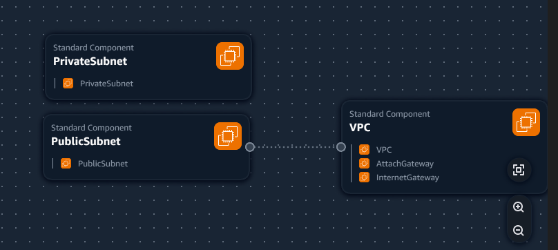
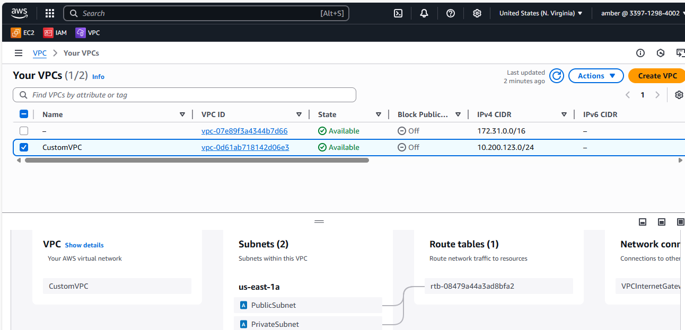
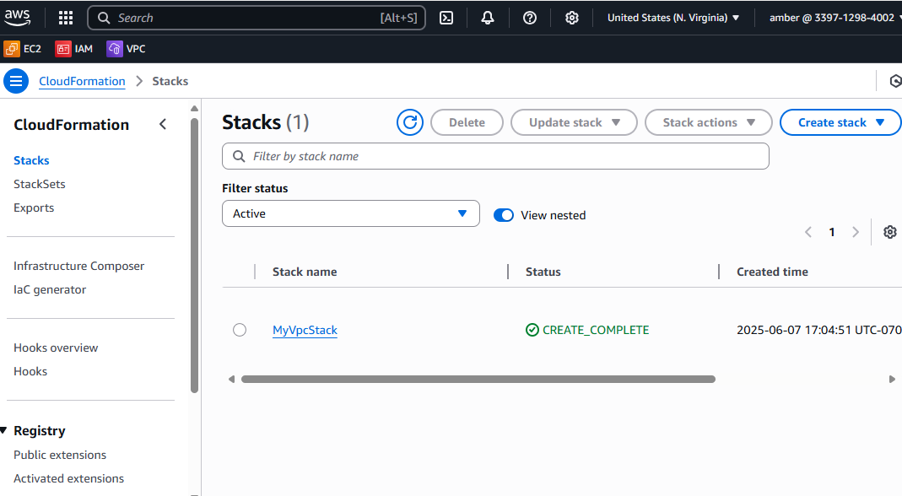

## VPC Settings

These are the VPC Settings we observed Tim set up for our cloud environment for our cloud environment in AWS: 

-  VPC IPv4 CIDR Block: 10.200.123.0/24
-  IPv6 CIDR Block: No
-  Number of AZs: 1
-  Number of public subnets: 1
-  Number of private subnets: 1
-  NAT GATEWAYS: None
-  VPC Endpoints: None
-  DNS Options: Enable DNS Hostnames
-  DNS Options: Enable DNS Resolution

## Generated and Review CFN Template

Watching the instructors videos, I noted the VPC Settings, provided this to LLM to produce the CFN template to automate the provision of the VPC Infrastructure.

-  I had to ask the LLM to refactor the parameters of the template so that it would not hardcode values and it would be more reasonable. 

## Generated bin/deploy script

Using ChatGPT generated bash script 'bin/deploy' I generated a bang to work with all OS models.

## Tried to deploy

Invalid template path vpc-template.yaml. I will change the path name to our yaml filename.

## Updated the Region 

I already have installed the VPC with that ip range in that region and I believe that is why I am getting an ValidationError when calling the CreateChangeSet operation. So I updated the Region to us-central-1. 

## Updated the Stack Name

I updated the stack name to NetBootVPC.

## Validation Error

The validation error was not due to the vpc. I asked Amazon Q and got the return that the code was trunkated. When it was at the private subnet it cut off after the S in AWS::EC2::Subnet with no following parameters. Amazon Q code added the complete version and I was able to deploy. 

## Visualization in Infrastructure Composer

I thought that maybe we could visualize our VPC via the Infrastructure Composer but its not the best representation.

## Visualization in VPC Resource Mapping

I took a screenshot of the map for the vpc. 

## Visualization in CFS Creation

I was able to take a screenshot of the created CFS. I think because I didn't open up another bash it still used the old naming conventions but it worked. 

## Installing AWS CLI

In order to deploy via the AWS CLI, we need to install it. ( I already have it installed.)

We follow the install instructions: https://docs.aws.amazon.com/cli/latest/userguide/getting-started-install.html